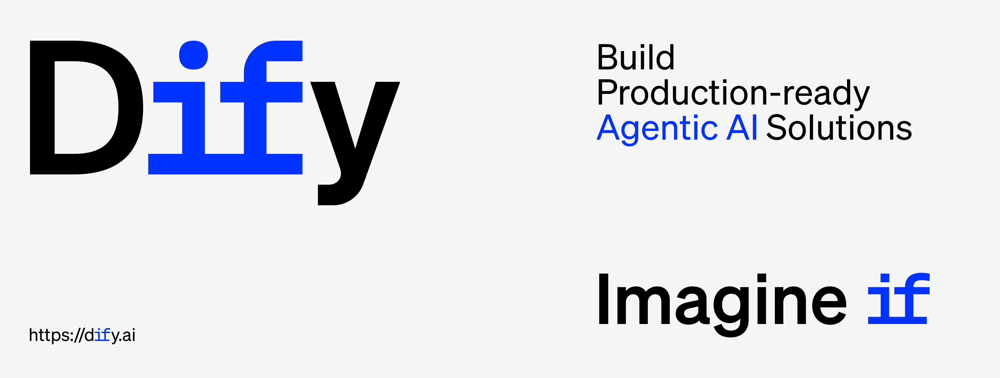

<p align="center">
  📌 <a href="https://dify.ai/blog/introducing-dify-workflow-file-upload-a-demo-on-ai-podcast">Introducing Dify Workflow File Upload: Recreate Google NotebookLM Podcast</a>
</p>

<p align="center">
  <a href="https://cloud.dify.ai">Dify Cloud</a> ·
  <a href="https://docs.dify.ai/getting-started/install-self-hosted">Self-hosting</a> ·
  <a href="https://docs.dify.ai">Documentation</a> ·
  <a href="https://dify.ai/pricing">Dify edition overview</a>
</p>

<p align="center">
    <a href="https://dify.ai" target="_blank">
        </a>
    <a href="https://dify.ai/pricing" target="_blank">
        </a>
    <a href="https://discord.gg/FngNHpbcY7" target="_blank">
        </a>
    <a href="https://reddit.com/r/difyai" target="_blank">  
        </a>
    <a href="https://twitter.com/intent/follow?screen_name=dify_ai" target="_blank">
        </a>
    <a href="https://www.linkedin.com/company/langgenius/" target="_blank">
        </a>
    <a href="https://hub.docker.com/u/langgenius" target="_blank">
        </a>
    <a href="https://github.com/langgenius/dify/graphs/commit-activity" target="_blank">
        </a>
    <a href="https://github.com/langgenius/dify/" target="_blank">
        </a>
    <a href="https://github.com/langgenius/dify/discussions/" target="_blank">
        </a>
</p>

<p align="center">
  <a href="./README.md"></a>
  <a href="./README_TW.md"></a>
  <a href="./README_CN.md"></a>
  <a href="./README_JA.md"></a>
  <a href="./README_ES.md"></a>
  <a href="./README_FR.md"></a>
  <a href="./README_KL.md"></a>
  <a href="./README_KR.md"></a>
  <a href="./README_AR.md"></a>
  <a href="./README_TR.md"></a>
  <a href="./README_VI.md"></a>
  <a href="./README_DE.md"></a>
  <a href="./README_BN.md"></a>
</p>

Dify is an open-source LLM app development platform. Its intuitive interface combines agentic AI workflow, RAG pipeline, agent capabilities, model management, observability features, and more, allowing you to quickly move from prototype to production.

## 🔥 Latest Features

### 首页智能体设置增强
- **智能体分类管理**: 支持创建分类并管理首页展示的智能体
- **多种项目类型**: 支持应用、Markdown说明和外部链接三种类型
- **统一图标选择**: 使用系统统一的图标选择器，支持emoji和自定义图片
- **Markdown渲染**: Markdown类型项目在独立页面中渲染，支持完整的Markdown语法
- **外部链接**: URL类型项目点击直接跳转到外部页面
- **统一管理**: 在智能体配置页面可以统一管理所有类型的项目

#### 功能详情
1. **项目类型**:
   - **应用**: 链接到现有的AI应用，点击跳转到聊天页面
   - **Markdown**: 展示说明文档，点击在新页面中渲染Markdown内容
   - **URL**: 外部链接，点击跳转到指定网址

2. **图标系统**:
   - 使用系统统一的AppIconPicker组件
   - 支持emoji选择和背景色自定义
   - 支持上传自定义图片作为图标
   - 与系统其他地方的图标选择保持一致

3. **页面路由**:
   - 首页: `/home` - 展示所有分类和项目
   - 智能体配置: `/agent-config` - 管理分类和项目
   - Markdown渲染: `/markdown/[id]` - 独立页面渲染Markdown内容

4. **数据库结构**:
   - `agent_categories`: 分类表
   - `agent_category_apps`: 项目表，支持多种类型
   - 字段包括: `item_type`, `name`, `description`, `icon`, `icon_background`, `markdown_content`, `url`

## Quick start

> Before installing Dify, make sure your machine meets the following minimum system requirements:
>
> - CPU >= 2 Core
> - RAM >= 4 GiB

</br>

The easiest way to start the Dify server is through [docker compose](docker/docker-compose.yaml). Before running Dify with the following commands, make sure that [Docker](https://docs.docker.com/get-docker/) and [Docker Compose](https://docs.docker.com/compose/install/) are installed on your machine:

```bash
cd dify
cd docker
cp .env.example .env
docker compose up -d
```

After running, you can access the Dify dashboard in your browser at [http://localhost/install](http://localhost/install) and start the initialization process.

#### Seeking help

Please refer to our [FAQ](https://docs.dify.ai/getting-started/install-self-hosted/faqs) if you encounter problems setting up Dify. Reach out to [the community and us](#community--contact) if you are still having issues.

> If you'd like to contribute to Dify or do additional development, refer to our [guide to deploying from source code](https://docs.dify.ai/getting-started/install-self-hosted/local-source-code)

## Key features

**1. Workflow**:
Build and test powerful AI workflows on a visual canvas, leveraging all the following features and beyond.

**2. Comprehensive model support**:
Seamless integration with hundreds of proprietary / open-source LLMs from dozens of inference providers and self-hosted solutions, covering GPT, Mistral, Llama3, and any OpenAI API-compatible models. A full list of supported model providers can be found [here](https://docs.dify.ai/getting-started/readme/model-providers).


**3. Prompt IDE**:
Intuitive interface for crafting prompts, comparing model performance, and adding additional features such as text-to-speech to a chat-based app.

**4. RAG Pipeline**:
Extensive RAG capabilities that cover everything from document ingestion to retrieval, with out-of-box support for text extraction from PDFs, PPTs, and other common document formats.

**5. Agent capabilities**:
You can define agents based on LLM Function Calling or ReAct, and add pre-built or custom tools for the agent. Dify provides 50+ built-in tools for AI agents, such as Google Search, DALL·E, Stable Diffusion and WolframAlpha.

**6. LLMOps**:
Monitor and analyze application logs and performance over time. You could continuously improve prompts, datasets, and models based on production data and annotations.

**7. Backend-as-a-Service**:
All of Dify's offerings come with corresponding APIs, so you could effortlessly integrate Dify into your own business logic.

## Feature Comparison

<table style="width: 100%;">
  <tr>
    <th align="center">Feature</th>
    <th align="center">Dify.AI</th>
    <th align="center">LangChain</th>
    <th align="center">Flowise</th>
    <th align="center">OpenAI Assistants API</th>
  </tr>
  <tr>
    <td align="center">Programming Approach</td>
    <td align="center">API + App-oriented</td>
    <td align="center">Python Code</td>
    <td align="center">App-oriented</td>
    <td align="center">API-oriented</td>
  </tr>
  <tr>
    <td align="center">Supported LLMs</td>
    <td align="center">Rich Variety</td>
    <td align="center">Rich Variety</td>
    <td align="center">Rich Variety</td>
    <td align="center">OpenAI-only</td>
  </tr>
  <tr>
    <td align="center">RAG Engine</td>
    <td align="center">✅</td>
    <td align="center">✅</td>
    <td align="center">✅</td>
    <td align="center">✅</td>
  </tr>
  <tr>
    <td align="center">Agent</td>
    <td align="center">✅</td>
    <td align="center">✅</td>
    <td align="center">❌</td>
    <td align="center">✅</td>
  </tr>
  <tr>
    <td align="center">Workflow</td>
    <td align="center">✅</td>
    <td align="center">❌</td>
    <td align="center">✅</td>
    <td align="center">❌</td>
  </tr>
  <tr>
    <td align="center">Observability</td>
    <td align="center">✅</td>
    <td align="center">✅</td>
    <td align="center">❌</td>
    <td align="center">❌</td>
  </tr>
  <tr>
    <td align="center">Enterprise Feature (SSO/Access control)</td>
    <td align="center">✅</td>
    <td align="center">❌</td>
    <td align="center">❌</td>
    <td align="center">❌</td>
  </tr>
  <tr>
    <td align="center">Local Deployment</td>
    <td align="center">✅</td>
    <td align="center">✅</td>
    <td align="center">✅</td>
    <td align="center">❌</td>
  </tr>
</table>

## Using Dify

- **Cloud </br>**
  We host a [Dify Cloud](https://dify.ai) service for anyone to try with zero setup. It provides all the capabilities of the self-deployed version, and includes 200 free GPT-4 calls in the sandbox plan.

- **Self-hosting Dify Community Edition</br>**
  Quickly get Dify running in your environment with this [starter guide](#quick-start).
  Use our [documentation](https://docs.dify.ai) for further references and more in-depth instructions.

- **Dify for enterprise / organizations</br>**
  We provide additional enterprise-centric features. [Log your questions for us through this chatbot](https://udify.app/chat/22L1zSxg6yW1cWQg) or [send us an email](mailto:business@dify.ai?subject=[GitHub]Business%20License%20Inquiry) to discuss enterprise needs. </br>
  > For startups and small businesses using AWS, check out [Dify Premium on AWS Marketplace](https://aws.amazon.com/marketplace/pp/prodview-t22mebxzwjhu6) and deploy it to your own AWS VPC with one click. It's an affordable AMI offering with the option to create apps with custom logo and branding.

## Staying ahead

Star Dify on GitHub and be instantly notified of new releases.


## Advanced Setup

If you need to customize the configuration, please refer to the comments in our [.env.example](docker/.env.example) file and update the corresponding values in your `.env` file. Additionally, you might need to make adjustments to the `docker-compose.yaml` file itself, such as changing image versions, port mappings, or volume mounts, based on your specific deployment environment and requirements. After making any changes, please re-run `docker-compose up -d`. You can find the full list of available environment variables [here](https://docs.dify.ai/getting-started/install-self-hosted/environments).

If you'd like to configure a highly-available setup, there are community-contributed [Helm Charts](https://helm.sh/) and YAML files which allow Dify to be deployed on Kubernetes.

- [Helm Chart by @LeoQuote](https://github.com/douban/charts/tree/master/charts/dify)
- [Helm Chart by @BorisPolonsky](https://github.com/BorisPolonsky/dify-helm)
- [Helm Chart by @magicsong](https://github.com/magicsong/ai-charts)
- [YAML file by @Winson-030](https://github.com/Winson-030/dify-kubernetes)
- [YAML file by @wyy-holding](https://github.com/wyy-holding/dify-k8s)

#### Using Terraform for Deployment

Deploy Dify to Cloud Platform with a single click using [terraform](https://www.terraform.io/)

##### Azure Global

- [Azure Terraform by @nikawang](https://github.com/nikawang/dify-azure-terraform)

##### Google Cloud

- [Google Cloud Terraform by @sotazum](https://github.com/DeNA/dify-google-cloud-terraform)

#### Using AWS CDK for Deployment

Deploy Dify to AWS with [CDK](https://aws.amazon.com/cdk/)

##### AWS

- [AWS CDK by @KevinZhao](https://github.com/aws-samples/solution-for-deploying-dify-on-aws)

## Contributing

For those who'd like to contribute code, see our [Contribution Guide](https://github.com/langgenius/dify/blob/main/CONTRIBUTING.md).
At the same time, please consider supporting Dify by sharing it on social media and at events and conferences.

> We are looking for contributors to help translate Dify into languages other than Mandarin or English. If you are interested in helping, please see the [i18n README](https://github.com/langgenius/dify/blob/main/web/i18n/README.md) for more information, and leave us a comment in the `global-users` channel of our [Discord Community Server](https://discord.gg/8Tpq4AcN9c).

## Community & contact

- [GitHub Discussion](https://github.com/langgenius/dify/discussions). Best for: sharing feedback and asking questions.
- [GitHub Issues](https://github.com/langgenius/dify/issues). Best for: bugs you encounter using Dify.AI, and feature proposals. See our [Contribution Guide](https://github.com/langgenius/dify/blob/main/CONTRIBUTING.md).
- [Discord](https://discord.gg/FngNHpbcY7). Best for: sharing your applications and hanging out with the community.
- [X(Twitter)](https://twitter.com/dify_ai). Best for: sharing your applications and hanging out with the community.

**Contributors**

<a href="https://github.com/langgenius/dify/graphs/contributors">
  
</a>

## Star history

[](https://star-history.com/#langgenius/dify&Date)

## Security disclosure

To protect your privacy, please avoid posting security issues on GitHub. Instead, send your questions to security@dify.ai and we will provide you with a more detailed answer.

## License

This repository is available under the [Dify Open Source License](LICENSE), which is essentially Apache 2.0 with a few additional restrictions.

## 手机验证码登录

系统支持使用手机验证码进行登录。该功能使用阿里云短信服务发送验证码。

### 配置要求

1. 阿里云账号和短信服务
   - 开通阿里云短信服务
   - 创建短信签名
   - 创建短信模板（验证码模板）

2. 环境变量配置
   ```bash
   # 阿里云短信服务配置
   ALIYUN_ACCESS_KEY_ID=your_access_key_id
   ALIYUN_ACCESS_KEY_SECRET=your_access_key_secret
   ALIYUN_SMS_SIGN_NAME=your_sign_name
   ALIYUN_SMS_TEMPLATE_CODE=your_template_code
   SMS_CODE_EXPIRE_SECONDS=300  # 验证码有效期（秒）
   ```

### API 接口

1. 发送验证码
   ```
   POST /auth/phone/send-code
   Content-Type: application/json
   
   {
     "phone": "13800138000"
   }
   ```

2. 验证码登录
   ```
   POST /auth/phone/login
   Content-Type: application/json
   
   {
     "phone": "13800138000",
     "code": "123456"
   }
   ```

### 注意事项

1. 验证码有效期为5分钟
2. 同一手机号60秒内只能发送一次验证码
3. 验证码使用后立即失效
4. 新用户首次登录将自动创建账号

## Docker Deployment Guide

### Prerequisites

Before you begin, ensure you have the following installed:
- Docker (version 20.10.0 or later)
- Docker Compose (version 2.0.0 or later)

### Quick Start with Docker

1. **Clone the Repository**
```bash
git clone https://github.com/langgenius/dify.git
cd dify
```

2. **Configure Environment**
```bash
cd docker
cp .env.example .env
```
Edit the `.env` file to configure your environment variables. Key configurations include:
- Database settings
- Redis settings
- Vector store settings
- Storage settings
- API and Web URLs

3. **Start Services**
```bash
docker compose up -d
```

4. **Access the Application**
- Web Console: http://localhost
- API Service: http://localhost/api

### Building Docker Images

You can build the Docker images locally if you need to customize the build process:

1. **Build Web Image**
```bash
cd web
docker build -t langgenius/dify-web:latest .
```

2. **Build API Image**
```bash
cd api
docker build -t langgenius/dify-api:latest .
```

### Docker Compose Services

The `docker-compose.yaml` file includes the following services:

1. **Web Service**
   - Frontend application
   - Nginx server
   - Static file serving

2. **API Service**
   - Backend API server
   - Celery workers
   - Task queue management

3. **Database Services**
   - PostgreSQL with pgvector
   - Redis for caching
   - Vector database (Weaviate/Milvus/OpenSearch)

4. **Additional Services**
   - Certbot for SSL certificates
   - OpenTelemetry collector
   - SSRF proxy

### Environment Variables

Key environment variables in `.env`:

```bash
# API Configuration
CONSOLE_API_URL=http://localhost/api
SERVICE_API_URL=http://localhost/api
APP_WEB_URL=http://localhost

# Database Configuration
DB_USERNAME=postgres
DB_PASSWORD=your_password
DB_HOST=db
DB_PORT=5432
DB_DATABASE=dify

# Redis Configuration
REDIS_HOST=redis
REDIS_PORT=6379
REDIS_PASSWORD=your_password

# Vector Store Configuration
VECTOR_STORE=weaviate  # Options: weaviate, milvus, opensearch
WEAVIATE_ENDPOINT=http://weaviate:8080

# Storage Configuration
STORAGE_TYPE=local  # Options: local, s3, azure, gcs
```

### Production Deployment

For production deployment, consider the following:

1. **Security**
   - Use strong passwords
   - Enable SSL/TLS
   - Configure proper firewall rules
   - Set up proper access controls

2. **Performance**
   - Configure appropriate resource limits
   - Set up proper caching
   - Optimize database settings

3. **Monitoring**
   - Enable OpenTelemetry
   - Set up logging
   - Configure health checks

4. **Backup**
   - Regular database backups
   - Volume backups
   - Configuration backups

### Troubleshooting

Common issues and solutions:

1. **Container Startup Issues**
```bash
# Check container logs
docker compose logs [service_name]

# Check container status
docker compose ps
```

2. **Database Connection Issues**
```bash
# Check database logs
docker compose logs db

# Test database connection
docker compose exec db psql -U postgres -d dify
```

3. **API Service Issues**
```bash
# Check API logs
docker compose logs api

# Restart API service
docker compose restart api
```

### Additional Resources

- [Docker Documentation](https://docs.docker.com/)
- [Docker Compose Documentation](https://docs.docker.com/compose/)
- [Dify Documentation](https://docs.dify.ai)
